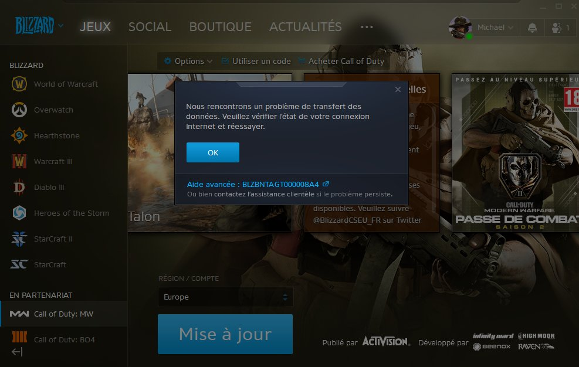

## Warzone update fixer

Tu voulais jouer à Warzone mais t'as une co de paysan ?


Comme t'es un gars malin t'as laissé ton pc g@m3r allumé toute la nuit pour télécharger ce foutu jeu ! Et là, après des heures d'attentes, tout content à l'idée de te faire enfin dérouiller par un AX-50 capteur thermique, tu tombes là dessus !



Rien de bien grâve, c'est pas une société qui fait 7.5B $ de revenus qui va laisser ses g@mers en galère ? 

 

Arf, pas de nouvelle depuis une semaine, ça pue...

Ne t'inquiète pas Kevin, j'ai la solution ! __Warzone update fixer__

Ce petit script va te changer la vie ! Plus besoin de surveiller ton pc ! Laisse le tourner toute la nuit, __il relancera automatiquement le téléchargement à chaque crash des serveurs de Blizzard !__

Grâce à son fonctionnement absolument pas optimisé, ce script est même capable de savoir quand la mise à jour est terminée ! _Il va pas cliquer comme un débile sur le gros bouton bleu et lancer le jeu pendant que t'es pas là_.

## Installation

Faut installer [Tesseract](https://github.com/tesseract-ocr/tesseract/wiki#windows) avec un set de données [Français](https://github.com/tesseract-ocr/tessdata_best/blob/master/fra.traineddata). Tout est marqué dans le premier lien. Je vais pas te mâcher le travail, tu sais lire...

```bash
pip install Pillow
pip install pytesseract
```

## Utilisation

1. Tu lances la mise à jour.
2. `python start.py`
3. Puis tu re clique sur le client Blizzard pour le mettre au premier plan.
4. T'éteins ton écran.
5. Tu vas lire un livre Kevin ! C'est fini les jeux vidéos pour aujourd'hui.

## Principe

C'est complètement con, ça prend un capture d'écran du gros bouton bleu du client Blizzard pendant la mise jour. S'il y'a marquer mise à jour, ça clique sur la popup et ensuite sur le gros bouton bleu... Et ça recommence au bout de 30 secondes, c'est débile.